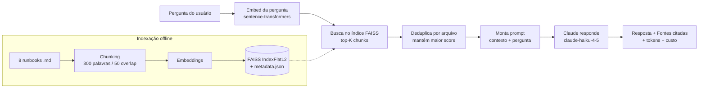
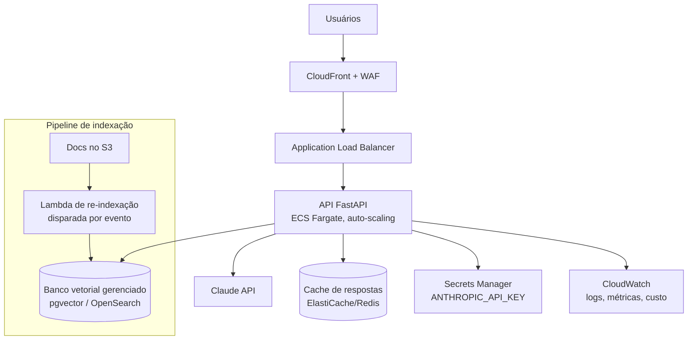

# projeto3-rag-runbooks 🔎🤖


Sistema **RAG (Retrieval-Augmented Generation)** que indexa runbooks de
infraestrutura AWS e responde perguntas técnicas em português, **citando as
fontes**. Projeto capstone da Fase 1.

A ideia: em vez de a LLM "chutar" de memória, o sistema primeiro **busca** os
trechos mais relevantes dos seus runbooks e só então pede para a Claude responder
**baseada nesse contexto**. Assim as respostas ficam fundamentadas na sua
documentação real e rastreáveis até o arquivo de origem.

---

## 🎯 Sobre o projeto

### Que problema resolve?
Uma equipe de infraestrutura/DevOps mantém dezenas de **runbooks** (manuais de
"como resolver o problema X"). Quando dá um incêndio às 3h da manhã, o engenheiro
de plantão precisa achar a resposta **rápido** — mas ninguém lê 8 documentos
inteiros sob pressão.

Este projeto troca o "Ctrl+F em vários arquivos" por uma pergunta em linguagem
natural: *"como faço rollback de um serviço ECS?"* → resposta com o passo a passo
certo, **citando de qual runbook ela saiu**.

### Objetivo
Como capstone da Fase 1, o objetivo é **demonstrar domínio de RAG** — a técnica
mais usada hoje para conectar LLMs ao conhecimento privado de uma empresa, sem
alucinação e com respostas rastreáveis.

### Para qual público?
- **Usuário final:** engenheiros de plantão, suporte, ou qualquer pessoa que
  precise achar resposta numa base de documentos sem ler tudo.
- **Quem implanta:** times de DevOps/Plataforma/IA que querem um "ChatGPT que só
  sabe das coisas da própria empresa".
- **Neste contexto de estudo:** vitrine de portfólio mostrando um pipeline de IA
  completo (embeddings → busca vetorial → LLM → API → frontend → testes → avaliação).

### Onde se aplica (o mesmo padrão, em produção)
| Uso | Exemplo |
|---|---|
| Suporte interno (DevOps/SRE) | runbooks, wikis de incidentes (este caso) |
| Atendimento ao cliente | bot sobre a base de conhecimento / FAQ |
| Jurídico / RH | dúvidas sobre contratos, políticas, normas internas |
| Documentação de produto | "como configuro X?" buscando nos docs oficiais |
| Saúde / finanças | consulta a protocolos e regulamentações |

### Onde rodar tecnicamente
É uma API FastAPI + frontend, então roda em qualquer lugar com Python: container
Docker no **ECS/Kubernetes**, uma VM **EC2**, ou serverless. Trocando o FAISS local
por um banco vetorial gerenciado (pgvector, OpenSearch, Pinecone), escala para
milhões de documentos. Veja [Caminho para produção](#-caminho-para-produção).

---

## 🧠 Como o RAG funciona (explicação para leigos)

Imagine um plantonista novato com um arquivo enorme de manuais. Quando alguém
pergunta "como resolvo o erro 502 do load balancer?", ele não lê os 8 manuais
inteiros — ele vai direto na página certa e responde com base nela.

O RAG faz exatamente isso, em duas etapas:

1. **Recuperação (Retrieval):** transformamos cada pedaço dos manuais em uma lista
   de números (um "embedding") que captura o *significado* do texto. A pergunta
   também vira números. Aí comparamos: quais pedaços têm significado mais parecido
   com a pergunta? Esses são recuperados.
2. **Geração (Generation):** entregamos esses pedaços para a Claude junto com a
   pergunta e pedimos: "responda usando **apenas** isto". A Claude redige a
   resposta final em português e nós mostramos de quais arquivos ela saiu.

O resultado: respostas precisas, no tom de quem conhece a sua infra, sem
alucinação, e sempre com a fonte citada.

---

## 🏗️ Arquitetura



Fluxo em texto:

```
Pergunta → Embed da query → Busca FAISS (top-K) → Recupera chunks
        → Monta prompt com contexto → Claude responde → Retorna com fontes citadas
```

---

## 📁 Estrutura do projeto

```
projeto3-rag-runbooks/
├── data/
│   ├── runbooks/         # 8 runbooks em PT-BR (.md)
│   └── index/            # índice gerado (gitignored)
├── src/
│   ├── config.py         # configuração central (caminhos, modelos, preços)
│   ├── indexer.py        # chunking + embeddings + índice FAISS
│   ├── retriever.py      # busca semântica + deduplicação
│   ├── rag.py            # motor RAG (busca + prompt + Claude)
│   ├── cli.py            # interface de linha de comando
│   ├── api.py            # API REST (FastAPI) + serve o frontend
│   └── eval.py           # avaliação automática (precision@k)
├── web/
│   └── static/           # frontend web (index.html, style.css, app.js)
├── docs/                 # documentação detalhada (ver abaixo)
├── tests/                # testes unitários (indexer, retriever, rag)
├── requirements.txt
├── Makefile
├── .env.example
├── LICENSE
└── README.md
```

### 📚 Documentação

| Documento | Conteúdo |
|---|---|
| [docs/ARQUITETURA.md](docs/ARQUITETURA.md) | Detalhes técnicos: componentes, fluxos, decisões de design, contratos de dados e pontos de extensão. |
| [docs/RUNBOOK.md](docs/RUNBOOK.md) | Procedimentos operacionais e troubleshooting do próprio sistema. |
| [docs/VARIAVEIS-DE-AMBIENTE.md](docs/VARIAVEIS-DE-AMBIENTE.md) | Template e referência de todas as variáveis de ambiente. |

---

## 🚀 Quick start

```bash
# 1. Instala dependências em um venv (.venv)
make setup

# 2. Configura a chave da Claude
cp .env.example .env       # edite e coloque sua ANTHROPIC_API_KEY

# 3. Indexa os runbooks (gera data/index/)
make index

# 4. Pergunta!
make query Q="Como resolver erro 502 no ALB?"
```

Outros usos:

```bash
# Modo interativo (várias perguntas em loop)
.venv/bin/python src/cli.py --interactive

# Ajustando quantos trechos recuperar
make query TOP_K=5 Q="Quais são os passos para investigar um spike de custo?"

# Subir a API REST + frontend web
make web    # http://localhost:8000  (UI) — API docs em /docs

# Avaliação automática
make eval

# Testes (não precisam de API key)
make test
```

### Frontend web 🖥️

Suba o servidor com `make web` e acesse **http://localhost:8000** no navegador.
A interface (tema escuro) oferece:

- caixa de pergunta com seletor de **top-k** e sugestões prontas;
- resposta renderizada com **fontes citadas** (chips com score de relevância);
- contador de **tokens e custo** por pergunta;
- barra lateral com o **status do índice** e a lista de runbooks indexados,
  destacando quais foram usados como fonte na última resposta.

O frontend é servido pela própria API FastAPI (`web/static/`), então não há
segundo servidor — `/` entrega a UI e `/query`, `/health`, `/runbooks` a alimentam.

```
┌──────────────┬────────────────────────────────────────┐
│ 🔎 RAG       │  Assistente de Plantão                 │
│              │                                        │
│ ● Índice ok  │  [Como faço rollback de ECS?] [502...] │
│ 8 runbooks   │  ┌──────────────────────────────────┐  │
│ 16 chunks    │  │ Resposta        412 tok · $0.0005│  │
│              │  │ Para fazer rollback, aponte o... │  │
│ Runbooks:    │  │                                  │  │
│  alb-502  2  │  │ Fontes  📄 ecs-deployment 0.71   │  │
│  ecs-dep  2  │  └──────────────────────────────────┘  │
│  rds...   2  │  [ Digite sua pergunta…  ] top-k [Perguntar]
└──────────────┴────────────────────────────────────────┘
```

### API REST

```bash
# Perguntar
curl -X POST http://localhost:8000/query \
  -H "Content-Type: application/json" \
  -d '{"question": "Como faço rollback de um serviço ECS?", "top_k": 3}'

# Saúde do serviço
curl http://localhost:8000/health

# Runbooks indexados
curl http://localhost:8000/runbooks
```

Resposta de `/query`:

```json
{
  "answer": "Para fazer rollback, aponte o serviço de volta para a revisão...",
  "sources": [{"file": "ecs-deployment.md", "score": 0.71}],
  "tokens": 412,
  "cost_usd": 0.000523
}
```

---

## 📊 Resultados da avaliação (`make eval`)

A avaliação roda 10 perguntas de teste, cada uma com um runbook esperado e
palavras-chave esperadas na resposta. Métricas:

- **Precision@3**: a fonte correta apareceu entre os trechos recuperados?
- **Cobertura de keywords**: os termos esperados apareceram na resposta?

<!-- BENCHMARK -->
Resultados reais de uma execução de `make eval` com `claude-haiku-4-5`:

| Métrica | Resultado |
|---|---|
| **Precision@3 (fonte correta recuperada)** | **100% (10/10)** ✅ |
| **Cobertura de keywords na resposta** | **85% (17/20)** |
| Tokens totais (10 perguntas) | 22.032 |
| Custo total estimado (10 perguntas) | **US$ 0,036** (~US$ 0,0036/pergunta) |

A **recuperação** (precision@3) é determinística: nas 10 perguntas de teste, o
runbook correto apareceu entre os 3 trechos recuperados em **100% dos casos**. A
**cobertura de keywords** mede se os termos técnicos esperados aparecem na resposta
gerada — 85% indica respostas fiéis ao contexto (as 3 "faltas" são sinônimos, ex.:
a resposta diz "alvos íntegros" em vez da keyword literal "saudáveis").

Detalhe por pergunta:

```
#   Fonte correta?   Keywords
1   ✓  ecs-deployment.md      2/2   Como faço rollback de um serviço ECS?
2   ✓  alb-502-errors.md      2/2   Como resolver erro 502 no ALB?
3   ✓  cost-spike.md          2/2   investigar spike de custo na AWS
4   ✓  rds-failover.md        1/2   failover manual no RDS Multi-AZ
5   ✓  ec2-troubleshooting.md 2/2   instância EC2 com CPU alta
6   ✓  security-incident.md   2/2   conter credencial IAM comprometida
7   ✓  vpc-connectivity.md    2/2   não consigo conectar na VPC
8   ✓  on-call-checklist.md   1/2   triagem de alerta de plantão
9   ✓  rds-failover.md        2/2   restaurar banco RDS point-in-time
10  ✓  alb-502-errors.md      1/2   diferença entre 503 e 502 no load balancer

Precision@3: 10/10 = 100%   |   Keywords: 17/20 = 85%   |   Custo: US$ 0,036
```

> Os números de geração dependem da `ANTHROPIC_API_KEY`. Rode `make eval` para
> reproduzir (a recuperação é gratuita; só a geração das respostas chama a Claude).

---

## 🛠️ Decisões técnicas

- **Embeddings locais (`all-MiniLM-L6-v2`)**: gratuitos, rodam offline, 384
  dimensões. Não precisam de API, o que reduz custo e latência da indexação.
- **FAISS `IndexFlatL2`**: busca exata por distância euclidiana. Para 8 runbooks é
  instantâneo; para milhões de vetores trocaríamos por um índice aproximado (IVF/HNSW).
- **Chunking 300 palavras / 50 de overlap**: equilibra contexto suficiente por
  trecho com granularidade de busca; a sobreposição evita cortar uma instrução no meio.
- **Deduplicação por arquivo**: garante diversidade de fontes — em vez de 3 trechos
  do mesmo runbook, traz os 3 runbooks mais relevantes.
- **Modelo da Claude**: `claude-haiku-4-5` (classe econômica, ótima para Q&A com
  contexto). O spec original citava `claude-3-haiku`, **depreciado** (sai em
  abr/2026); usamos o Haiku atual, configurável via `CLAUDE_MODEL` no `.env`.

---

## 🎯 Skills demonstradas

- **Embeddings**: vetorização semântica de texto com `sentence-transformers`.
- **Vector search**: indexação e busca por similaridade com FAISS.
- **RAG**: pipeline completo de recuperação + geração aumentada por contexto.
- **LLM integration**: integração com a Claude API, contagem de tokens e custo.
- **FastAPI**: API REST com validação via Pydantic e documentação automática.
- **CLI com Rich**: interface de terminal colorida com barra de progresso.
- **Testes**: cobertura de chunking, busca, dedup e RAG com mocks (sem custo de API).
- **Avaliação de IA**: métricas objetivas (precision@k, cobertura de keywords).

---

## 🚀 Caminho para produção

Hoje o projeto é um **protótipo sólido em escala pequena** (FAISS local, 8
runbooks, sem auth). A arquitetura já está pronta para evoluir — abaixo, como ele
iria para produção na AWS e o que precisaria mudar.



| Aspecto | Protótipo (hoje) | Produção |
|---|---|---|
| Banco vetorial | FAISS local (arquivo) | pgvector / OpenSearch / Pinecone (escala milhões) |
| Re-indexação | manual (`make index`) | automática via evento S3 → Lambda quando o doc muda |
| Autenticação | nenhuma | OAuth/SSO, API keys, rate limiting |
| Histórico | nenhum | conversas salvas por usuário |
| Custo/latência | 1 chamada por pergunta | cache de respostas frequentes (Redis) |
| Segredos | `.env` local | AWS Secrets Manager |
| Hospedagem | `uvicorn` local | container em ECS Fargate atrás de ALB + CloudFront |
| Qualidade | precision@k offline | avaliação contínua + feedback do usuário (👍/👎) |

> Nada disso muda o **núcleo** do sistema — o pipeline RAG (`indexer → retriever →
> rag`) permanece igual. É exatamente esse desacoplamento que torna o projeto um
> bom alicerce.

---

## 🔧 Requisitos

- Python 3.12
- Uma `ANTHROPIC_API_KEY` (apenas para gerar respostas; indexação e testes não precisam)
- ~500 MB para os modelos de embeddings na primeira execução

---

## 📄 Licença

Distribuído sob a licença **MIT** — veja [LICENSE](LICENSE) para os termos completos.
